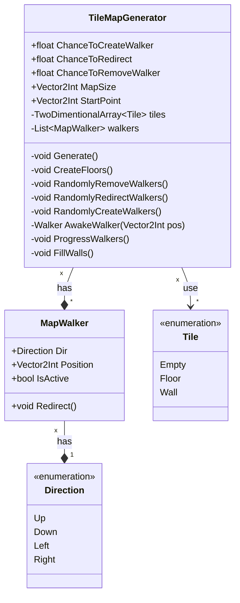
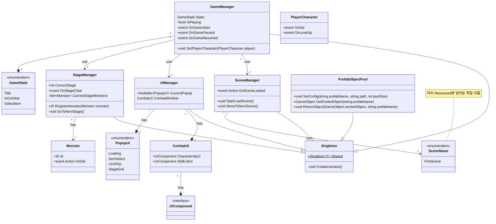

## Tile Map generator class

> [알고리즘](https://bartshin.github.io/TIL/unity/2025.04.28_Resources%2CTile_map_generate/#tile-map-generate)   
## Manager class

### Game Manager
- 다른 매니저를 연결 시키고 게임의 상태를 관리하는 역할  
### Stage Manager
- 현재 스테이지 상태를 관리하고 스테이지를 진행시키는 역할  
### Scene Manager
- 상황에 맞는 scene을 로딩하고 전환하는 역할  
### UI Manager
- 게임 상태를 보여주고 사용자가 캐릭터, 아이템 등을 변경할 수 있게 하는 역할   
#### CombatUI
- 전투 플레이중 사용자에게 제공되는 UI   
#### PrefabObjectPool 
- Prefab에 따른 Object pool을 관리하는 역할   
- Resources 디렉토리에 넣어둔 prefab들을 생성할 수 있다   

---

